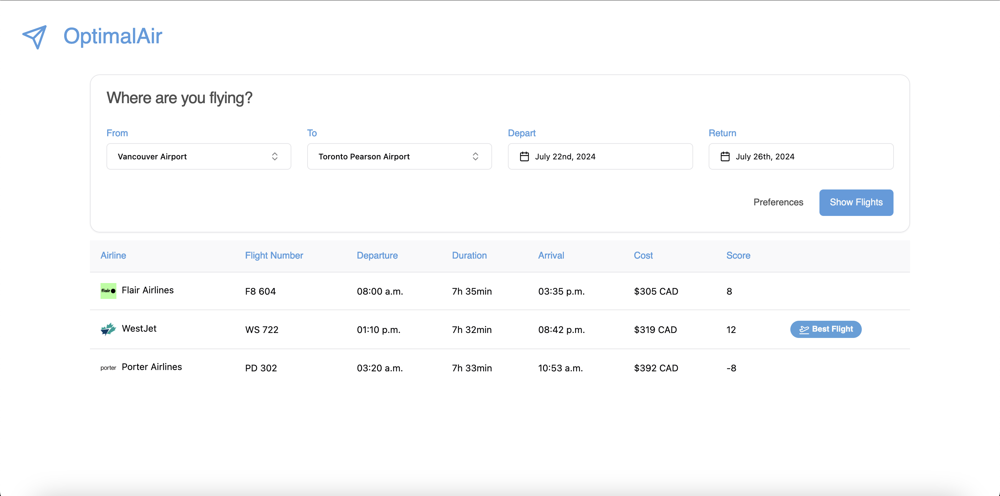

# OptimalAir

OptimalAir is a web application designed to help users find the best flights based on their preferences for cost, duration, and whether the flight is a red-eye. The project is composed of a backend server written in Python and a frontend application built with React and Vite.



## Table of Contents

- [Prerequisites](#prerequisites)
- [Installation](#installation)
- [Running the Backend Server](#running-the-backend-server)
- [Running the Frontend](#running-the-frontend)
- [Environment Variables](#environment-variables)
- [Scripts](#scripts)

## Prerequisites

Before you begin, ensure you have the following installed:

- Node.js (version 14 or later)
- npm (version 6 or later)
- Python (version 3.8 or later)
- pip (Python package installer)

## Installation

1. Clone the repository:

    ```bash
    git clone https://github.com/yourusername/optimalair.git
    cd optimalair
    ```

2. Install frontend dependencies:

    ```bash
    npm install
    ```

3. Install backend dependencies:

    ```bash
    cd backend
    python3 -m venv venv
    source venv/bin/activate
    pip install -r requirements.txt
    ```

## Running the Backend Server

1. Make sure you have your SerpAPI key. You can obtain one by signing up at [SerpAPI](https://serpapi.com/).

2. Create a `.env` file in the `backend` directory and add your SerpAPI key:

    ```plaintext
    SERPAPI_KEY=your_serpapi_key
    ```

3. Run the backend server:

    ```bash
    cd backend
    source venv/bin/activate
    python3 run.py
    ```

## Running the Frontend

1. Start the frontend development server:

    ```bash
    npm run dev
    ```

2. Open your browser and navigate to `http://localhost:5173`.

## Environment Variables

The backend requires an environment variable for the SerpAPI key. This should be stored in a `.env` file located in the `backend` directory.

Example `.env` file:

```plaintext
SERPAPI_KEY=your_serpapi_key
```

Happy flying!
